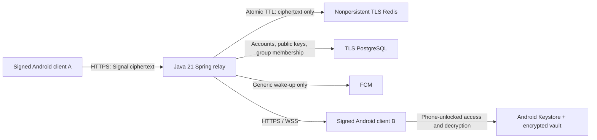

# Architecture

Vanishr is an Android-first one-device-per-account messenger with direct chats
and invite-only groups of up to 200 members. The
implementation is a security-focused development foundation, not a reviewed
production messaging service. Read [THREAT-MODEL.md](THREAT-MODEL.md) first.

## Ownership

- `client-core`: official libsignal 0.102.3 session adapter, independently pinned
  identities, authenticated content envelope, AES-256-GCM image encryption.
- `android`: native UI, Android Keystore storage, crash-consistent ciphertext
  outbox and acknowledgements, image import, expiry, notifications, HTTPS/WSS.
- `relay`: Spring Boot 3.5.16, BCrypt account login, opaque hashed-token sessions,
  PostgreSQL public prekey distribution, atomic Redis delivery and deletion.
- `infra`: digest-pinned local containers, verified TLS for every service,
  memory-bounded Redis without disk persistence, replication or swap.

The Maven relay has a **test-only** client-core dependency for integration tests.
The packaged relay has no libsignal or client-core dependency and no decrypt API.
The Android app is distributed separately, not served as executable web code by
the relay. A server compromise therefore does not replace running client code.

Foreground startup automatically opens the vault when the phone is unlocked.
Backgrounding clears the UI and closes the in-memory engine; returning reopens
the encrypted state without a separate app PIN or device-credential prompt.
Legacy authentication-bound vault/content keys migrate atomically to new
phone-unlocked keys without consuming view-once content or extending expiry.

Google and password accounts retain an encrypted, rotating renewal credential so
ordinary reopening does not require provider/password input after the one-hour
access token expires. The request layer renews before expiry or retries once after
a 401. The relay atomically rotates hash-only access/renewal records; renewal is
bounded to 30 days and tied to the current device generation. The client commits
a random replacement handle before rotation to recover a lost response. Network
failure retains encrypted account state; rejected renewal clears credentials only.
Explicit sign-out removes both credentials and parks content as before. Redis
reset, device replacement or 30 days without renewal requires sign-in again.

A separate bounded HTTPS client checks the static download site's `updates.json`
at most daily automatically, or on demand from My profile. It sends no account
credentials or identifiers and never shares the relay client's bearer token.
Strict metadata validation permits only a newer compatible APK at the fixed
versioned download URL. Checks run independently of chat work. The prompt opens
the browser; package installation and signer validation belong to Android, not
a downloaded runtime-code loader. The same staging operation publishes the APK,
checksum, version manifest, corresponding source and notices.

## Account storage and roles

The hosted dev/test deployment runs PostgreSQL on the existing `vanishr-dev` VM
in `vanishr-dev-rg`. Database `vanishr`, table `public.accounts`, stores account
UUID, current unique handle, password verifier or Google subject mapping,
optional display name and server-controlled user type. The Compose `accounts`
named volume is mounted at `/var/lib/postgresql/data`, with PGDATA under `pgdata`.
PostgreSQL is on the private container network with verified TLS; it is not a
public database endpoint or a Firebase user table. Vercel hosts only static
release files and no user database.

`accounts.id` is immutable; changing `handle` preserves the ID. Previous handles
are not retained as rename history and can be reused by another account. Roles
are attached to the UUID: migration V5 defaults all accounts to `USER`, permits
only `USER`/`ADMIN`, and does not automatically promote any username. Only the
database operator can assign a role; the new authenticated `/account/type` read
is self-only. The role permits initiating Remote Photos with separate owner
approval; it grants no group-owner authority, access to other chat content or
encryption exception. Existing Android releases are unchanged.

Encrypted queued messages/media and bounded session/presence records are held
in nonpersistent Redis, not in the account table. Private keys and retained chat
content remain in the Android client's Keystore-protected encrypted vault.

## Content flow

1. Each client creates an identity locally, registers only its public key, and
   uploads a bounded batch of public one-time/signed/Kyber prekeys.
2. Users find each other by username and compare safety numbers over an independently
   authenticated channel. The app pins the public identity. No automatic TOFU.
3. Sender claims a recipient prekey bundle and asks libsignal to establish a
   session. Bundles are consumed atomically; absent prekeys fail closed.
4. An authenticated inner envelope binds sender/recipient/device IDs, message
   ID, expiry mode, sent timestamp, absolute deadline and any image descriptor.
5. Signal encryption and the durable encrypted outbox commit together with
   updated ratchet state. Retries resend exactly that ciphertext and identifier.
6. The relay validates bounds and authorization but never interprets content.
   All Redis payload writes use an expiry in the same operation.
7. Recipient decrypts and validates the envelope locally, stores protected local
   content and ratchet state in one atomic transaction, then acknowledges delivery.
8. Timed payloads/blobs are deleted from Redis on delivery. View-once payloads
   are deleted on read. All payloads and receipts expire at the hard deadline.

## Group flow

GroupDirectory serializes membership mutations and validates capacity, roles and
device bindings. GroupMessages stores one shared ciphertext/blob with independent
recipient receipts in memory-only Redis. The relay never imports client crypto.
GroupChat retains encrypted group state inside the existing account vault and
uses official libsignal SignalGroup sender keys scoped to group/epoch/sender.

The owner pins invitee identities; invitees pin the owner and explicitly accept
the trust model. Owner-authenticated roster digests and titles, then sender-key
distributions, travel over pairwise Signal sessions. Membership changes rotate
epochs and pause sending until the owner's approval is available. New members
receive no old epoch keys. Batched controls/prekey claims bound request work;
one generic wake can represent many queued changes. Only the selected current
account can access its groups; sign-out parks them with its existing keys/outbox.

## Remote Photos

An admin starts Photos from a verified direct chat. One owner approval starts a
separate, visible foreground photo service; Android controls its photo access.
The service keeps an isolated, memory-only libsignal session, not the chat vault,
and uses a separate authenticated photo websocket plus bounded HTTPS exchanges.
Thus normal chat background cleanup and Online/Typing semantics stay unchanged.

MediaStore ID pagination reads thumbnail pages on demand without a fixed photo
count limit. Only a tapped original is read and streamed as 16 KiB chunks; the
relay never receives a gallery archive or plaintext photo metadata. Grid cells
are recycled, the thumbnail cache is bounded, and only one original is assembled
at a time (current memory-safety maximum 64 MiB, display edge at most 4096 pixels).
No received-photo disk files are written. The foreground notification's End access
action, viewer lock, sign-out, role/identity changes and hard session/packet expiry
end access; Android does not restart a stopped session automatically. The local
post-0.4.2 client permits an already approved owner service to continue after the
owner locks the phone, with explicit approval wording and a redacted lock-screen
notification. New approval/startup still requires unlock. The normal chat vault
remains closed, and losing a secure screen lock or required Android permissions
ends the session. The immutable published 0.4.2 APK is not changed by this work.

## Profile and contact names

An account has an immutable UUID, a mutable globally unique username and an optional
owner-chosen shared display name. The latter two are ordinary server-visible account
metadata, not E2EE message content. Both update APIs derive ownership from the device
session, reject target IDs in the body and apply bounded validation/rate limits.
Changing either field leaves device IDs, identity keys, sessions and messages intact.
Password login uses the current username; Google retains its stable subject mapping.

An optional private nickname is stored under `contact-name/<peer UUID>` only in the
current account's encrypted local vault. It overrides the displayed contact name for
that account alone. Shared profile refresh is by peer UUID, not the former username,
and never overwrites the nickname or pinned identity. At most ten contacts and the
current account are refreshed every thirty seconds while the app synchronizes.
An old username can be claimed by another account, but cannot redirect a saved chat.

## Retention semantics

Expiry modes: `VIEW_ONCE`, `HOUR_1`, `HOURS_6`, `HOURS_24`. Client expiry starts
when it encrypts, so offline queueing consumes lifetime. Server acceptance can
only shorten the allowed remaining lifetime, never extend it past 24 hours.
The encrypted envelope independently authenticates the deadline; a dishonest
relay cannot extend local lifetime simply by editing routing metadata.

Images are limited to 2 MiB after on-device normalization; encrypted blobs are
held in Redis rather than persistent object storage. Detached uploads expire
after at most five minutes. Attaching a blob atomically gives it the message's
deadline. Recipient-only authenticated downloads have no public permanent URL.

Receipts contain no content and remain until the original deadline. Read receipts
are relay assertions, not independently signed proofs. A dishonest relay can
fake them; a malicious recipient can retain content regardless of expiry.

## Availability and limits

The MVP intentionally uses a single relay/Redis instance, one device per account,
100 local content entries, 2 MiB images, 16 KiB UTF-8 text, bounded prekey batches,
and bounded IP/account/device rate limits. Foreground polling every 15 seconds
backs up WSS wake-ups. FCM is optional and generic; credentials must be supplied.
An authenticated existing session can queue encrypted outgoing content offline.
Starting a new session requires online public-prekey retrieval.

No background decryption occurs while the vault is closed. Notification
navigation does not change that boundary: an opted-in FCM payload carries only
a generic event and opaque expiring reference. After unlock, the app resolves it
through the authenticated relay, syncs and validates the specific local message
and conversation trust before opening the chat. Invalid/stale references return
to the list, and view-once content still needs explicit Open. The relay keeps
one bounded mapping per device, not a public chat identifier in the push.

Devices offline for 24 hours lose pending content and may need to republish prekeys. Redis restart
loses pending delivery and tokens by design. PostgreSQL persists only minimal
accounts/devices/public keys and group membership metadata. There is no message
recovery, history search, server-side media decoding, reactions, calls or cloud
chat backup. A 200-member limit is not a load guarantee; full multi-device load
and independent group-protocol integration review remain release requirements.

## Operational boundaries

Production startup checks TLS, disabled Redis AOF/snapshots, bounded memory,
no-eviction policy and no replication. Those checks do not audit the host:
disable Docker/VM/host swap, hibernation, core dumps, packet capture, backups of
ephemeral RAM, request-body logging, proxy access logs and APM payload collection.
Logical deletion is not a provable physical wipe. Use read-only non-root
containers and secret management; review the deployment before real use.